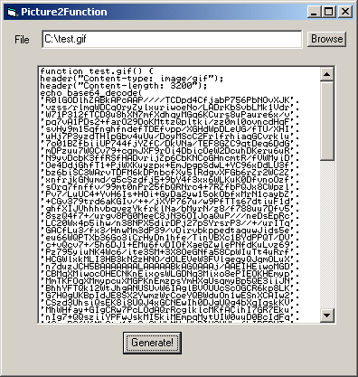



## convert any image to a php function to insert directly into your code\!\!

### Description

this code takes gif,jpeg,bmp,png or tiff images and using base64 encodeing it converts the image into a function that can be called directly in your php scripts!
 
### More Info
 

             |
---                |---
**Submitted On**   |2001-10-01 06:29:12
**By**             |[Don Steele](https://github.com/Planet-Source-Code/PSCIndex/blob/master/ByAuthor/don-steele.md)
**Level**          |Intermediate
**User Rating**    |5.0 (25 globes from 5 users)
**Compatibility**  |VB 5\.0, VB 6\.0
**Category**       |[Internet/ HTML](https://github.com/Planet-Source-Code/PSCIndex/blob/master/ByCategory/internet-html__1-34.md)
**World**          |[Visual Basic](https://github.com/Planet-Source-Code/PSCIndex/blob/master/ByWorld/visual-basic.md)
**Archive File**   |[convert an273211012001\.zip](https://github.com/Planet-Source-Code/don-steele-convert-any-image-to-a-php-function-to-insert-directly-into-your-code__1-27708/archive/master.zip)

